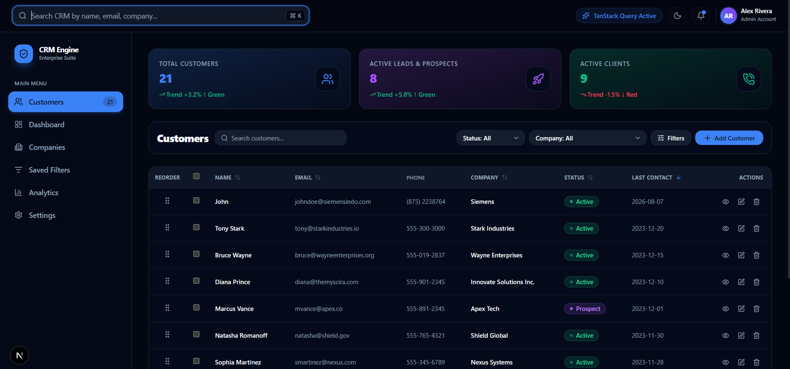

# Modern CRM & Customer Management Dashboard

A modern, responsive CRM web application for managing customer relationships, customer records, sales information, interactions, and account activity from a centralized dashboard.

The application provides a complete customer management workflow with CRUD operations, advanced search, filtering, sorting, pagination, bulk actions, saved filter views, customer details, interaction timelines, dashboard analytics, optimistic UI updates, and dark/light theme support.

## Tech Stack Justification

### Frontend: Next.js + React + TypeScript

- **Next.js 16**: Provides a modern React application architecture using the App Router, reusable layouts, and production-ready rendering capabilities.
- **React 19**: Component-based architecture makes the CRM interface modular, reusable, and easier to maintain.
- **TypeScript**: Provides compile-time type safety for customer records, forms, filters, hooks, and application components.
- **Tailwind CSS v3**: Utility-first styling provides a consistent, responsive interface and supports the CRM's light and dark themes.

### State & Data Management: TanStack Query

- **TanStack Query v5**: Handles server-state management, query caching, background refetching, mutations, loading states, error handling, and query invalidation.
- **Optimistic Updates**: Supported mutations update the interface immediately while background synchronization keeps the data consistent.

### Forms & Validation

- **React Hook Form**: Provides efficient form-state management for creating and editing customer records.
- **Zod**: Provides schema-based validation for customer information and ensures valid form input.
- **@hookform/resolvers**: Integrates Zod validation with React Hook Form.

### UI & Utilities

- **Lucide React**: Provides consistent and lightweight icons throughout the CRM interface.
- **Sonner**: Provides toast notifications for successful and failed customer operations.
- **next-themes**: Provides Dark/Night Mode and Light Mode theme switching.
- **@hello-pangea/dnd**: Provides drag-and-drop functionality for saved filter views.
- **date-fns**: Provides date formatting and date manipulation utilities.
- **clsx + tailwind-merge**: Used for reusable and conditionally composed Tailwind CSS classes.

## Tech Stack

| Category | Technology |
| --- | --- |
| Framework | Next.js 16 |
| Frontend | React 19 |
| Language | TypeScript |
| Styling | Tailwind CSS v3 |
| State Management | TanStack Query v5 |
| Forms | React Hook Form |
| Validation | Zod |
| Drag & Drop | @hello-pangea/dnd |
| Icons | Lucide React |
| Notifications | Sonner |
| Theme Management | next-themes |
| Date Utilities | date-fns |
| Utility Libraries | clsx, tailwind-merge |
| Version Control | Git & GitHub |

## Features

### Dashboard

- Total Customers metric
- Active Leads & Prospects metric
- Active Clients metric
- Customer trend indicators
- Customer activity overview
- Global search
- Customer filters
- Add Customer action
- Customer management table
- Pagination and sorting

**Dashboard Screenshot:**



### Customer Management

- Add new customer records
- View customer profiles
- Edit existing customers
- Delete customers
- Update customer status
- Track customer contact information
- Track company information
- Track deal value
- Track account ownership
- Track last contact date
- Maintain customer interaction history

**Customer Details Screenshot:**


### Search Functionality

Users can instantly search customer records using:

- Customer Name
- Email
- Company
- Phone

Search results are updated dynamically while typing.

The search functionality uses debouncing to provide a responsive user experience and reduce unnecessary processing.

**Search Example:**

```text
Search: Dia

Matching result:

Diana Prince
diana@themyscira.com
Innovate Solutions Inc.

Search Screenshot:

Advanced Filtering

The CRM provides an advanced filtering system for customer records.

Available filters include:

Status
Company
Email
Phone
Date Range

Features include:

Multiple filter conditions
Search + filter combination
Dynamic result updates
Reset filters
Filter-aware pagination

Filter Example:

Status: Active
Company: Siemens
Sorting

Customer records can be sorted in ascending or descending order.

Supported sorting fields include:

Customer Name
Company
Status
Last Contact Date
Created Date

Sorting works together with:

Search
Filters
Pagination

Data Processing Flow:

Customer Data
      ↓
Filters
      ↓
Search
      ↓
Sort
      ↓
Pagination
      ↓
Customer Table
Pagination

The customer table supports configurable pagination.

Available page sizes include:

5
10
20
50

Features include:

Previous button
Next button
Current page indicator
Dynamic record count
Search-aware pagination
Filter-aware pagination

Pagination Example:

Showing 1 to 10 of 21 entries
Bulk Actions

Multiple customer records can be selected using checkboxes.

Supported actions include:

Select individual customers
Select all customers
Bulk status update
Bulk delete

Bulk actions allow users to manage multiple customer records efficiently.

Saved Filter Views

Frequently used filter configurations can be saved as reusable views.

Example views include:

Active Customers
Prospects
Recently Contacted
High Value Customers

Features include:

Save filter configurations
Restore saved filters
Reuse frequently used customer searches
Drag-and-drop reordering

The drag-and-drop functionality is implemented using:

@hello-pangea/dnd
Add Customer

Users can create new customer records using the Add Customer modal.

Available fields include:

Name
Email
Phone
Company
Status
Last Contact Date
Deal Value
Job Title
Initial Interaction Notes

Add Customer Screenshot:

Edit Customer

Existing customer records can be updated using the edit workflow.

Features include:

Prefilled customer information
Form validation
Status updates
Deal value updates
Job title updates
Notes updates
Customer information synchronization

After saving, the updated information is reflected in the customer table and customer details.

Form Validation

The customer form uses React Hook Form and Zod for validation.

Validation rules include:

Customer name is required
Email is required
Email must have a valid format
Phone number is required
Company is required
Last contact date is required
Deal value is supported as an optional field
Job title is supported as an optional field
Interaction notes are supported as an optional field

Form Validation Flow:

Customer Form
      ↓
React Hook Form
      ↓
Zod Schema
      ↓
Validation
      ↓
Mutation
      ↓
TanStack Query
      ↓
Updated Customer Data
Customer Details

The customer details panel provides complete information about the selected customer.

Information includes:

Customer name
Customer initials/avatar
Job title
Company
Status
Email address
Phone number
Deal value
Last contact date
Account owner
Created date
Interaction timeline

Customer Details Screenshot:

Interaction Timeline

Customer profiles include an interaction timeline for maintaining customer history.

Users can record:

Meetings
Follow-ups
Customer requirements
Technical discussions
Sales conversations
Important account notes

Example Interaction:

Sarah Chen

12/20/2023

Integrating custom AI pipelines with our API.
Notifications

The application uses Sonner for user feedback.

Notifications are displayed for:

Customer creation
Customer updates
Customer deletion
Bulk actions
Validation errors
Failed operations

Example:

Customer added successfully
Theme Support

The CRM supports both Dark/Night Mode and Light Mode using next-themes.

Dark / Night Mode

The dark theme provides:

Dark navigation
Dark customer table
High-contrast cards
Colored status badges
Blue, purple, and green dashboard accents
Improved readability in low-light environments

Dark Mode Screenshot:

Light Mode

The light theme provides:

White navigation
Light customer table
Soft dashboard cards
Clear borders
High readability

Light Mode Screenshot:

Customer Data Model

The customer record is structured around the following information:

Customer
│
├── id
├── name
├── email
├── phone
├── company
├── status
├── lastContact
├── dealValue
├── jobTitle
├── accountOwner
├── createdDate
└── notes / interactions
Customer Status

Supported customer lifecycle statuses include:

Active
Lead
Prospect
Inactive

These statuses are used across:

Dashboard metrics
Customer table
Filters
Status badges
Bulk actions
Customer details
Data Processing

Customer records pass through a predictable processing pipeline:

Customer Data
      ↓
Filters
      ↓
Search
      ↓
Sort
      ↓
Pagination
      ↓
Customer Table

This allows the application to combine search, filtering, sorting, and pagination without duplicating customer records.

State Management

TanStack Query v5 is used for data fetching and server-state management.

The general flow is:

UI Component
      ↓
Custom Hook
      ↓
TanStack Query
      ↓
Customer Data
      ↓
UI Update

TanStack Query provides:

Query caching
Background refetching
Mutations
Query invalidation
Loading states
Error handling
Optimistic updates
Optimistic UI

Supported customer mutations can update the interface immediately while the background request is processed.

User Action
      ↓
Optimistic UI Update
      ↓
Background Mutation
      ↓
Success
      ↓
Cache Synchronization

This provides immediate feedback and improves the perceived performance of the CRM.

Project Structure
Greentiq Assesment
│
├── screenshots
│   ├── Add Customer details.png
│   ├── Customer Details.png
│   ├── Dashboard.png
│   ├── Search Functionalty.png
│   └── White Toggle.png
│
├── src
│   ├── app
│   │   ├── globals.css
│   │   ├── layout.tsx
│   │   └── page.tsx
│   │
│   ├── components
│   │   ├── common
│   │   ├── customers
│   │   ├── dashboard
│   │   ├── filters
│   │   ├── layout
│   │   ├── providers
│   │   └── search
│   │
│   ├── hooks
│   └── lib
│
├── AGENTS.md
├── package.json
├── README.md
├── tailwind.config.js
└── tsconfig.json
Getting Started
Prerequisites
Node.js 18+
npm, yarn, pnpm, or bun
Installation
cd "Greentiq Assesment"
npm install
Development
npm run dev

The application runs at:

http://localhost:3000
Production Build
npm run build
Production Server
npm run start

The production application runs at:

http://localhost:3000
Challenges Faced
Managing Multiple Table Operations

The customer table needs to handle search, filtering, sorting, pagination, selection, and bulk actions simultaneously.

Solution:

A predictable data-processing pipeline was implemented:

Customer Data
      ↓
Filters
      ↓
Search
      ↓
Sort
      ↓
Pagination
      ↓
Render
CRUD State Synchronization

Adding, editing, deleting, and viewing customers involves multiple UI components.

The main components include:

Customer Table
      ↕
Customer Form
      ↕
Customer Details
      ↕
TanStack Query

Solution:

TanStack Query and reusable hooks provide a centralized data-management approach and keep the customer information synchronized across the interface.

Form Validation

The customer form contains multiple required and optional fields.

Solution:

React Hook Form manages form state while Zod provides centralized schema validation.

Saved Filter Management

Saved views need to preserve their filter configurations while allowing users to reorder them.

Solution:

Saved filter configurations are managed independently and @hello-pangea/dnd provides drag-and-drop ordering.

Security & Data Integrity Considerations
TypeScript provides compile-time type checking.
Zod validates customer form input.
React Hook Form provides controlled form handling.
Customer mutations are managed through a structured data layer.
Toast notifications provide clear operation feedback.
Query invalidation helps keep customer data synchronized.
Production authentication can be added through Auth.js, JWT, or OAuth.
Role-based authorization can be added at the backend/API layer.
Sensitive customer information should be protected through server-side authorization and database security in a production deployment.
Assumptions
Customer Data

The application works with customer records containing:

ID
Name
Email
Phone
Company
Status
Last Contact Date
Deal Value
Job Title
Account Owner
Created Date
Notes / Interactions
Customer Status

The CRM uses four primary customer statuses:

Active
Lead
Prospect
Inactive
Pagination

Pagination is implemented to keep the customer table manageable and improve the user experience when handling larger datasets.

Search

Search is designed to work across multiple customer fields rather than being limited to the customer name.

Saved Views

Saved views represent reusable combinations of customer filters and are intended to speed up common CRM workflows.

Future Improvements
Backend Integration

Connect the CRM to a production backend using:

Node.js
Express
PostgreSQL
MongoDB

A backend would provide:

Permanent customer persistence
REST API endpoints
Server-side filtering
Server-side pagination
Authentication
Authorization
Authentication

Add secure authentication using:

Auth.js
JWT
OAuth
Role-Based Access Control

Introduce user roles such as:

Admin
Sales Manager
Sales Representative
Viewer

Possible permissions could include:

Feature	Admin	Sales Manager	Sales Representative	Viewer
View Dashboard	✅	✅	✅	✅
View Customers	✅	✅	✅	✅
Create Customer	✅	✅	✅	❌
Edit Customer	✅	✅	✅	❌
Delete Customer	✅	✅	❌	❌
Bulk Actions	✅	✅	✅	❌
Manage Users	✅	❌	❌	❌
Automated Testing

Add automated testing using:

Jest
React Testing Library
Playwright

Test areas include:

Customer CRUD
Search
Filtering
Sorting
Pagination
Form validation
Bulk actions
Saved views
Theme switching
CI/CD

Add GitHub Actions to automate:

Checkout
   ↓
Install Dependencies
   ↓
Lint
   ↓
Type Check
   ↓
Run Tests
   ↓
Build
   ↓
Deploy
Advanced CRM Analytics

Future dashboard improvements can include:

Revenue analytics
Lead conversion rate
Sales pipeline
Customer retention
Sales performance
Customer activity trends
Deal value analytics
Monthly customer growth
Real-Time Collaboration

WebSockets or Server-Sent Events can be added to synchronize customer changes between multiple CRM users.

Audit History

A production version can maintain a complete customer activity audit trail:

User
  ↓
Action
  ↓
Customer
  ↓
Timestamp
  ↓
Audit Log

This would allow administrators to track:

Customer creation
Customer updates
Customer deletion
Status changes
Bulk actions
Screenshots


